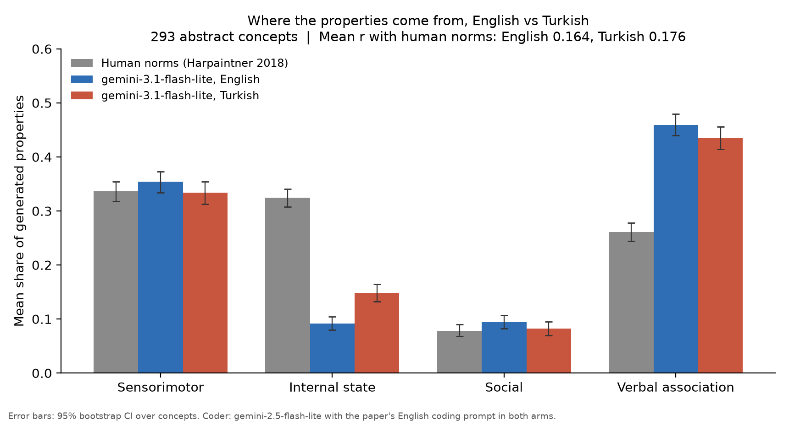

# The Grounding Gap: Benchmark Corrections and Turkish Extension

This repository builds upon *The Grounding Gap: How LLMs Anchor the Meaning of Abstract Concepts Differently from Humans* (Chlapanis, Menis Mastromichalakis, and Papadimitriou, arXiv:2605.08837; upstream code: [odychlapanis/grounding-gap](https://github.com/odychlapanis/grounding-gap)).

It provides:
1. **An exact reproduction** of the paper's Experiment 1 leaderboard (Table 4) and rating experiment (Table 6) from released runs, along with measurement-noise and coder-bias audits.
2. **Identification, measurement, and a verified patch for an upstream parser bug** that caused 25% to 40% of responses in affected models to be scored as all-zero vectors.
3. **An empirical corrected leaderboard** re-coding all recovered responses across affected models (`corrected_leaderboard.csv`).
4. **A cross-linguistic extension to Turkish**: evaluating whether transparent morphological grounding (agglutinative root transparency in abstract vocabulary) closes the grounding gap compared to English.

---

### Key Findings

#### 1. The Parser Bug and Benchmark Recalibration
In the upstream evaluation pipeline (`src/parsers.py`), the parser strictly required responses to begin with the literal label `properties:`. When models responded with valid formats such as `word: prop1, prop2, prop3, prop4` or itemized lists, the parser returned an empty list. In `evaluate.py`, these empty parses were scored as all-zero frequency vectors rather than excluded or parsed via fallbacks.

This bug systematically penalized specific models:
- **Gemini 2.5 Flash-Lite**: 720 of 2,930 runs (24.6%) failed parsing.
- **Llama 3.1 8B**: 1,194 of 2,930 runs (40.7%) failed parsing.
- **GPT-OSS 120B**: 493 of 2,930 runs (16.8%) failed parsing.
- **Gemini 2.5 Flash**: 89 of 2,930 runs (3.0%) failed parsing.

Dropping the unparsed rows needs no new model calls and uses only the paper's own coder (`gemini-2.5-flash-lite`), so the **Empties Dropped** column is the cleanest correction. The **Recovered & Re-coded** column adds the recovered properties back, but they were coded with `gemini-3.1-flash-lite` because `gemini-2.5-flash-lite` was no longer available, so that column mixes two coders and should be read as indicative (`corrected_leaderboard.csv`):

| Model | Released Mean *r* | Empties Dropped Mean *r* | Recovered & Re-coded Mean *r* | Unparsed Runs Dropped | Recovered Properties Added |
| :--- | :---: | :---: | :---: | :---: | :---: |
| **Gemini 2.5 Flash-Lite** | 0.348 | 0.394 | **0.401** | 720 | 703 |
| **Llama 3.1 8B** | 0.283 | 0.339 | **0.372** | 1,194 | 1,054 |
| **GPT-OSS 120B** | 0.199 | 0.239 | **0.244** | 493 | 491 |
| **Gemini 2.5 Flash** | 0.296 | 0.301 | **0.302** | 89 | 89 |

**Key Takeaways:**
- **Much of the 8B vs. 70B difference comes from parsing**: with unparsed rows dropped, Llama 3.1 8B moves from `0.283` to `0.339`, and the gap to Llama 3.1 70B (`0.375`, unaffected) shrinks from `0.092` to `0.036`. Re-coding the recovered answers narrows it further (`0.372`), subject to the mixed-coder caveat above.
- **Gemini 2.5 Flash-Lite moves to the top of the leaderboard**: `0.348` to `0.394` with unparsed rows dropped (`0.401` re-coded), above Llama 3.1 70B.
- **The grounding gap persists**: the best corrected model is still far below the human ceiling (`0.974`). The paper's headline finding is robust to the parser issue.

#### 2. The Turkish Extension: Testing Morphological Grounding
Critics might argue that LLMs fail to ground abstract concepts in English because English abstract vocabulary is predominantly Latinate, Greek, or borrowed (*justice*, *dignity*, *concept*, *institution*), severing surface tokens from physical sensorimotor roots.

In contrast, Turkish is agglutinative and features extensive 20th-century language reforms that deliberately coined abstract nouns from concrete physical roots (e.g., *izlenim* [impression] from *iz* [footprint], *görüş* [opinion] from *gör* [see]).

Across all 293 abstract concepts evaluated over 3 runs per language (using `gemini-3.1-flash-lite`):
- **Mean *r* with Harpaintner Human Norms**:
  - English: `0.164`
  - Turkish: `0.176`
  - **Turkish − English Difference**: `+0.012` (95% bootstrap CI `[-0.058, +0.092]`)
- **Within-Turkish Contrast (Transparent Native vs. Loanword)**:
  - Sensorimotor Difference-in-Differences: `-0.002` (95% CI `[-0.049, +0.048]`)
- **Robustness on Confidently Translated Concepts (`ok` subset, 203 words)**:
  - Difference: `-0.009` (95% CI `[-0.094, +0.076]`)
- **Coding Prompt Robustness**:
  - Re-coding Turkish outputs with a Turkish prompt yielded Mean *r* = `0.183` vs `0.176` (coding agreement `r = 0.813`).

- **Category shares (Turkish minus English, 95% CI)**:
  - Internal state: `+0.057` `[+0.039, +0.074]` (English `0.092`, Turkish `0.149`; humans `0.324`)
  - Verbal association: `-0.024` `[-0.046, -0.002]`

**Interpretation:**
Generating in Turkish shifts the category mix in the direction of the human norms: internal-state properties rise by about 60% and verbal associations fall. That shift does not translate into better per-concept alignment: the correlation with the human norms is unchanged within the precision of this experiment (the 95% interval rules out an improvement larger than about `0.09`). Whether a concept is expressed by a transparent native word or an opaque loanword makes no detectable difference. The results are consistent with the gap coming from text training rather than from English vocabulary, but a null result on one model with three runs does not establish that on its own.

---

### Visualizations

The category distribution comparison between human norms, English model generations, and Turkish model generations is illustrated below:



Both languages sit far from the human profile, but not identically: Turkish produces clearly more internal-state properties and slightly fewer verbal associations than English.

---

### Repository Structure

```
├── README.md                      # Public project documentation
├── requirements.txt               # Python dependencies
├── run_checks.sh                  # One-command verification script (no API key required)
├── corrected_leaderboard.csv      # Corrected benchmark scores for affected models
│
├── data/
│   ├── stimuli_tr.csv             # 293 Turkish stimuli with etymology, roots, and review flags
│   └── translation_review.json    # Audit trail of the native-speaker translation review
│
├── patches/
│   └── grounding-gap-parser-fix.patch # Patch for upstream property_generation_experiments
│
├── results/
│   ├── summary_all.txt            # Plaintext summary of the full 293-concept live experiment
│   ├── fig_en_vs_tr.png           # Category comparison figure (PNG)
│   ├── fig_en_vs_tr.pdf           # Category comparison figure (PDF)
│   ├── parser_bug/                # Disaggregated parser bug metrics across released models
│   ├── august_audit/              # Baseline reproduction and reliability checks
│   └── live_run/                  # Complete generation and coding outputs from the live run
│
├── scripts/
│   ├── run_section_7.py           # Re-codes unparsed outputs from the paper's released dataset
│   ├── run_pilot.py               # 30-concept pilot experiment
│   ├── run_full.py                # Full 293-concept experiment in English and Turkish
│   ├── verify_patch.py            # Applies patch to scratch repo and validates scores
│   ├── validate_stimuli.py        # Validates formatting and integrity of stimuli_tr.csv
│   └── build_notebook.py          # Builds Colab notebook from src/gg_tr.py and stimuli_tr.csv
│
├── src/
│   └── gg_tr.py                   # Core library: parsing, generation, coding, bootstrap statistics
│
└── notebooks/
    └── grounding_gap_turkish.ipynb # Self-contained Google Colab notebook
```

---

### Reproduction & Quick Start

#### 1. Run Offline Checks (No API Key Required)

Run all offline validation checks (Table 4 reproduction, parser bug check, patch verification, stimuli validation, mock pipeline test, and notebook execution):

```bash
git clone https://github.com/asyau/grounding-gap-turkish.git
cd grounding-gap-turkish
pip install -r requirements.txt
bash run_checks.sh
```

All 6 checks should report passing status within 60 seconds.

#### 2. Run the Live Turkish & English Experiment

Set your Gemini API key:

```bash
export GEMINI_API_KEY="your-gemini-api-key"
```

To re-code the paper's released unparsed answers (Section 7):
```bash
python scripts/run_section_7.py
```

To run the 30-concept pilot:
```bash
python scripts/run_pilot.py
```

To run the full 293-concept experiment across both languages:
```bash
python scripts/run_full.py
```

Outputs are automatically cached in `results/live_run/` so interrupted runs can resume seamlessly.

#### 3. Running in Google Colab

Open `notebooks/grounding_gap_turkish.ipynb` in [Google Colab](https://colab.research.google.com). Add your `GEMINI_API_KEY` to Colab Secrets, enable notebook access, and run all cells.

---

### Limitations

1. **Human Norms Reference**: Both English and Turkish model outputs are compared against the German human norming data from Harpaintner et al. (2018). While the paper's English stimulus list is also an English translation of those German concepts, a cross-language difference indicates a difference in model representation rather than proving whether Turkish human grounding differs.
2. **Translation Nuances**: The Turkish stimuli were translated from the paper's English list. 29 complex items underwent native-speaker review to resolve polysemy and synonyms (`docs/06_translation_review.md`).
3. **Model and coder change**: `gemini-2.5-flash-lite` was no longer available on the Gemini API for new users, so the live runs used `gemini-3.1-flash-lite` both to generate and to code. This keeps the English and Turkish arms comparable with each other, but not with the paper's leaderboard: the paper's released `gemini-3.1-flash-lite` runs, coded by `gemini-2.5-flash-lite`, score `0.223` on the same words, against `0.164` here, and the two English profiles agree at `r = 0.65`. The coder change is the most likely cause. The same caveat applies to the re-coded column of the corrected leaderboard.
4. **Scale of the Turkish experiment**: one model, three runs per language (the paper used ten).

---

### Citation & Attribution

This project builds upon:
- Chlapanis, O., Menis Mastromichalakis, O., & Papadimitriou, C. (2026). *The Grounding Gap: How LLMs Anchor the Meaning of Abstract Concepts Differently from Humans*. arXiv:2605.08837.
- Harpaintner, M., Trumpp, N. M., & Kiefer, M. (2018). *The Semantic Content of Abstract Concepts: A Property Listing Study of 296 Abstract Words*. Frontiers in Psychology, 9, 1748.
